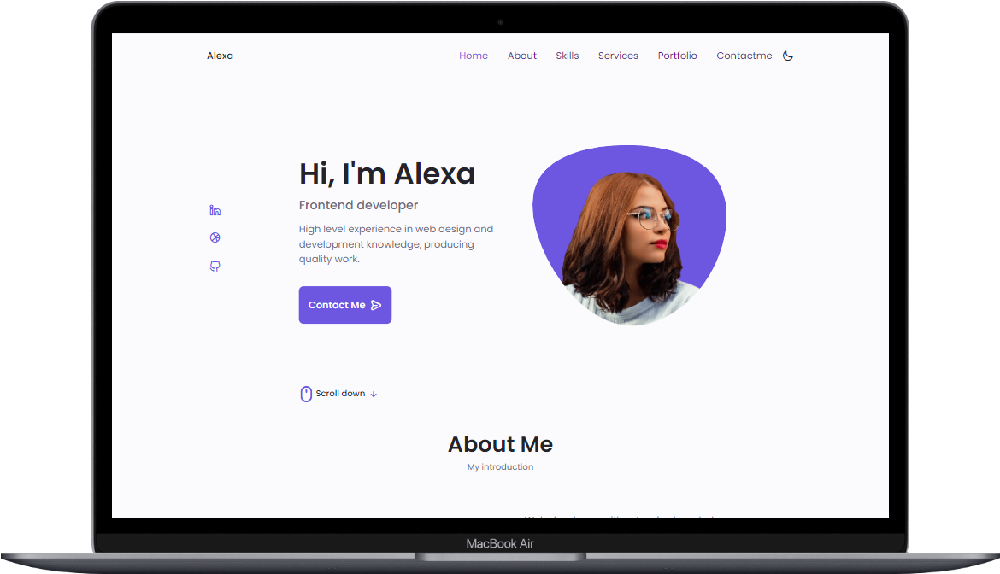
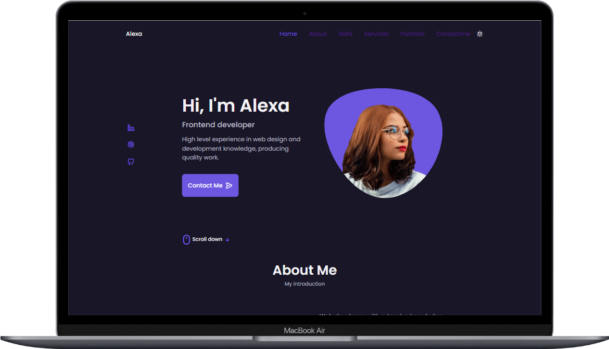
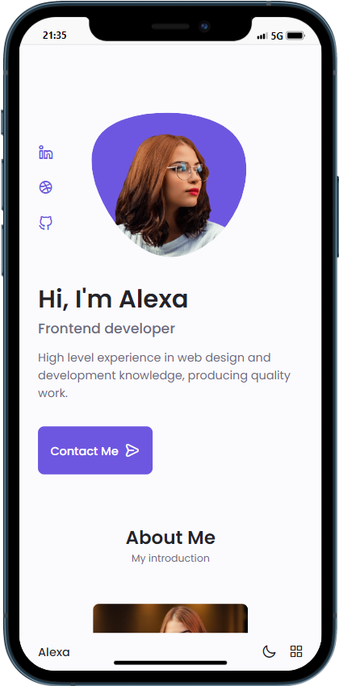
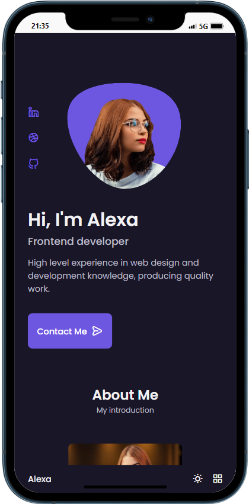
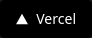

<h1 align="center" id="project_name">
  <br />          
    
    
     
  <br />
</h1>

<p align="center">
  Layout Landing Page.
</p>

<p align="center">
  <!-- GitHub last commit -->
  <a href="https://github.com/risaltte/portfolio-01/commits/master">
    
  </a>
  <!-- GitHub language count -->
  
  <!-- GitHub top language -->
  
  <!-- Repository size -->
  
  <!-- Repository status -->
  
  <!-- Link repo -->
  <a href="https://github.com/risaltte/portfolio-01/blob/master/LICENSE">
    
  </a>
</p>

<p align="center">
 <a href="#about">About</a> •
 <a href="#layout">Layout</a> • 
 <a href="#technologies">Technologies</a> • 
 <a href="#prerequisites">Prerequisites</a> •
 <a href="#demo">Demo</a> •
 <a href="#author">Autor</a> • 
 <a href="#license">License</a>
</p>

<h4 align="center">
  	🚧 Layout Portfolio with HTML, CSS and Javascript | Done 🚧
</h4>

<h2 id="about">
💻 About
</h2>

The layout portfolio were created based on <a href="https://www.youtube.com/@Bedimcode">Bedimcode</a> classes available on YouTube:
- **[Lesson 01](https://www.youtube.com/watch?v=27JtRAI3QO8&ab_channel=Bedimcode)**

<h2 id="layout">🎨 Layout</h2>

<p align="center">
  
  <br></br>
  
</p>
<br></br>

<p align="center" style="display: flex; align-items: flex-start; justify-content: center; gap: 16px;">
  
  
  
</p>

<br />
<h2 id="technologies">🛠 Technologies</h2>

The following tools were used in the construction of the project:

- **[HTML]**
- **[CSS]**
- **[Javascript]**

**Utilities**

- Unicons: **[Unicons](https://iconscout.com/unicons)**
- Swiper: **[Swiper](https://swiperjs.com/)**

<h2 id="prerequisites">💿 How to run the project</h2>

### 🧰 Prerequisites

Before you start, you will need to have the following tools installed on your machine:

> [Git](https://git-scm.com), [Node.js](https://nodejs.org/en/) or [Yarn](https://yarnpkg.com/) if you prefer.
> In addition it is good to have an editor to work with the code as [VSCode](https://code.visualstudio.com/)

### 🧭 Running the Project

```bash
# Clone repo
$ git clone https://github.com/risaltte/portfolio-01.git

# Access the project folder in the terminal/cmd
$ cd portfolio-01

# Open the project in the vscode
$ code .

# Install and run Live server on vscode

# see on http://localhost:5500

```

<h2 id="demo">🧪 Demo</h2>
<a href="https://risaltte.github.io/portfolio-01" target="_blank">
  
</a>
<br>

<a href="https://portfolio-01-lac.vercel.app" target="_blank">
<!-- Link externo ou local(.github). -->
    
</a>

<h2 id="author">🦸 Autor</h2>
<a href="https://github.com/risaltte">
 
 <br />
 <sub><b>Rafael Risalte</b></sub></a>

[](https://www.linkedin.com/in/rafaelrisalte/)
[](mailto:risaltte@gmail.com)

<h2 id="license">📝 License</h2>

Distributed under MIT license. See [LICENSE](LICENSE) for more information.

Made with ❤️ by Rafael Risalte 👋🏽 [Contact!](https://www.linkedin.com/in/rafaelrisalte/)

[⬆ Back to top](#project_name)<br />